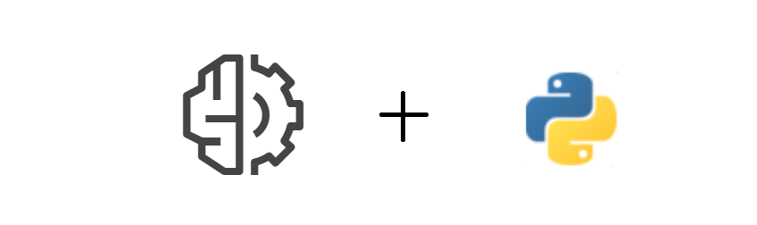
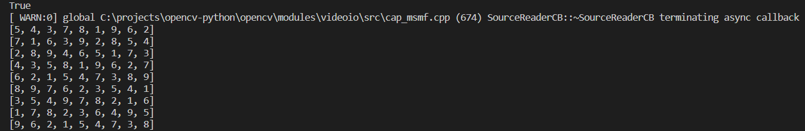

# aws-textract-sudoku-solver



## Requirements

```
pip install awscli
```

```
pip install opencv-python
```

After installation of ```awscli```, login by

```
aws configure
```

Now create a bucket in AWS S3 by

```
aws s3api create-bucket --bucket <bucket-name> --region <region-name> --create-bucket-configuration LocationConstraint=<region-name>
```

## Working

The file ```detect.py```, saves the image of the board and uploads it to the S3 bucket in AWS. Now by using Textract API with boto3 this image is analyzed with ```FeatureTypes``` as ```TABLES```. The digits are then fed to the sudoku solver which solves and prints the solution.

## Usage

Run the file ```detect.py```, and put your phone with the sudoku board image in front of your webcam

solved sample->




